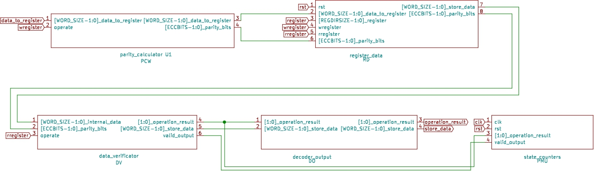

# **Space Shuttle**

[](https://opensource.org/licenses/Apache-2.0) [](https://github.com/efabless/caravel_project_example/actions/workflows/caravel_build.yml)

## **Authors**
- Ivan Rodriguez-Ferrandez (UPC¹-BSC²)
- Alvaro Jover-Alvarez (UPC¹-BSC²)
- Leonidas Kosmidis (BSC²-UPC¹)
<br/>
¹ Universitat Politècnica de Catalunya (UPC) <br/>
² Barcelona Supercomputing Center (BSC)


### **Main Version of the chip: 2.0V EXTENDED**  

<br/>

## **Change Log**

- Version 2.0V Extended:
  - Added support for the wishbone interface to access all of the internal register data.
  - Added a Monitoring Unit with counters for write and read operations, uncorrected and corrected errors for each of the 32 registers.
  - The Monitoring Unit is redundant in order to provide reliable values
  
- Version 2.0V:
  - Added support for shadow registers (duplication).
  - Added support for ECC shadow registers (duplication with ECC).
  - Added the possibility to store a value without any protection.
  
- Version 1.5V:
  - Bug fix wishbone interface counters.
  
- Version 1.4V:
  - Added option for TMR storage (Triple Modular Redundancy).
  
- Version 1.3V:
  - Increase from 8 registers to 32 registers.
  - Bug fix in the wishbone interface to correct access the internal register 31.

- Version 1.2V: 
  - Bug fix for the ECC generator.

- Version 1.1V:
  - Bug fix for the ECC parity detector.

- Version 1.0V:
  - Implemented ECC registers for 8 registers.

## **Current Look Of The Chip**


## **Description**

The main goal of this project is to assess the reliability of the SkyWater 130nm manufacturing process and Open Source PDK, as well as to evaluate different reliability mitigation techniques. Currently, the space industry relies on custom designs implemented with older mature manufacturing technologies such as 130nm or 65nm, which feature fault-tolerant and radiation hardening features. However, due to the small volume of space chips and to the closed environment of commercial EDA tools, the cost for space-specific (and other critical industries with similar reliability requirements such as avionics) is prohibitive for non-large corporations already operating in this domain, which limits innovation significantly. We have experienced this limitation first hand in our research institution through our close collaboration with the European Space Agency (ESA) in the framework of several research projects we are leading, such as the GPU4S (GPU for Space) ESA-funded activity.

However, with SkyWater 130nm and OpenLane, there is a great opportunity for lowering the barrier to entry in the safety-critical chip design market. In order this to happen, it is necessary to characterise the reliability of a test chip under stressful conditions, such as different types of irradiation, thermal and others. For this reason, in this open source test chip we implement the infrastructure which will be required to perform such an assessment for this technology for the first time.

In order to assess the reliability of a chip we require methods to be able to observe in a detailed way its internal state, so that not only we can identify whether errors (e.g. bitflips) have occurred, but also to know which part of the design has been affected. For this reason, the initial reliability assessment has to be performed in a design with relatively low complexity, high level of control and with appropriate facilities to provide the required information.

The most vulnerable parts of a hardware design are its memory structures because they retain their previous values. Therefore, in our chip we have decided to focus on error detection and error correction specifically on flip-flops and registers which are the primary memory storage primitives. Therefore, our design is centered around a register file with 32, 32-bit registers implemented with flip-flops. We have implemented multiple reliability solutions such as different degrees of replication and ECC around this register file, which can be selectively configured and combined (with some limitations), in order to reliably detect whether errors occur, and in case they do, whether they can be corrected. Moreover, we include a redundant Monitoring Unit consisting of detailed event counters for each of the registers. This way, we can also assess the protection level offered by these different reliability methods and study their trade-offs in order to guide future developments. 

In particular, our design has the following characteristics:
- 32, 32-bit register file implemented with flip-flops, organised in 8 banks which can be used in parallel. Each register value can be individually set or inspected. The register file can be either clocked with a user controled signal, offering full control, or with the default chip clock.

- 4 different protection mechanisms, each of which can be enabled selectively and in combination with others:
  - Error Correction Code (ECC): ECC with 1 bit correction and 2 bit correction.
  
  - Triple Redundancy: The input value is triplicated in the register file.
  
  - Shadow Register: The input value has a copy in the register file.
  
  - ECC Shadow Register: The input value has a copy in the register file with ECC protection of 1 bit correction and 2 bit correction.

- Duplicated Monitoring Unit: Individual 32-bit counters per register, reporting write and read operations performed, as well as the number of detected and corrected errors. Both the monitoring registers and their combinational counter circuit is replicated, ensuring reliable information.


## **How To Use The Chip**
This is a full example of how to use our design from caravel. In this example we write a value to the register 1 and then we read that value from the register file. This is the first, basic test of the chip. 

```C++

void main()
{
  /* Set up the housekeeping SPI to be connected internally so	*/
  /* that external pin changes don't affect it.			*/

  reg_spimaster_config = 0xa002;	// Enable, prescaler = 2,
                                // connect to housekeeping SPI
  reg_mprj_io_31 = GPIO_MODE_USER_STD_OUTPUT;
  reg_mprj_io_30 = GPIO_MODE_USER_STD_OUTPUT;
  reg_mprj_io_29 = GPIO_MODE_USER_STD_OUTPUT;
  reg_mprj_io_28 = GPIO_MODE_USER_STD_OUTPUT;
  reg_mprj_io_27 = GPIO_MODE_USER_STD_OUTPUT;
  reg_mprj_io_26 = GPIO_MODE_USER_STD_OUTPUT;
  reg_mprj_io_25 = GPIO_MODE_USER_STD_OUTPUT;
  reg_mprj_io_24 = GPIO_MODE_USER_STD_OUTPUT;
  reg_mprj_io_23 = GPIO_MODE_USER_STD_OUTPUT;
  reg_mprj_io_22 = GPIO_MODE_USER_STD_OUTPUT;
  reg_mprj_io_21 = GPIO_MODE_USER_STD_OUTPUT;
  reg_mprj_io_20 = GPIO_MODE_USER_STD_OUTPUT;
  reg_mprj_io_19 = GPIO_MODE_USER_STD_OUTPUT;
  reg_mprj_io_18 = GPIO_MODE_USER_STD_OUTPUT;
  reg_mprj_io_17 = GPIO_MODE_USER_STD_OUTPUT;
  reg_mprj_io_16 = GPIO_MODE_USER_STD_OUTPUT;

  reg_mprj_io_15 = GPIO_MODE_USER_STD_OUTPUT;
  reg_mprj_io_14 = GPIO_MODE_USER_STD_OUTPUT;
  reg_mprj_io_13 = GPIO_MODE_USER_STD_OUTPUT;
  reg_mprj_io_12 = GPIO_MODE_USER_STD_OUTPUT;
  reg_mprj_io_11 = GPIO_MODE_USER_STD_OUTPUT;
  reg_mprj_io_10 = GPIO_MODE_USER_STD_OUTPUT;
  reg_mprj_io_9  = GPIO_MODE_USER_STD_OUTPUT;
  reg_mprj_io_8  = GPIO_MODE_USER_STD_OUTPUT;
  reg_mprj_io_7  = GPIO_MODE_USER_STD_OUTPUT;
  reg_mprj_io_5  = GPIO_MODE_USER_STD_OUTPUT;
  reg_mprj_io_4  = GPIO_MODE_USER_STD_OUTPUT;
  reg_mprj_io_3  = GPIO_MODE_USER_STD_OUTPUT;
  reg_mprj_io_2  = GPIO_MODE_USER_STD_OUTPUT;
  reg_mprj_io_1  = GPIO_MODE_USER_STD_OUTPUT;
  reg_mprj_io_0  = GPIO_MODE_USER_STD_OUTPUT;

  reg_mprj_io_6  = GPIO_MODE_MGMT_STD_OUTPUT;

  // Set UART clock to 64 kbaud (enable before I/O configuration)
  reg_uart_clkdiv = 625;
  reg_uart_enable = 1;

  /* Apply configuration */
  reg_mprj_xfer = 1;
  while (reg_mprj_xfer == 1);

  // Configure LA probes 
	// outputs from the cpu are inputs for my project denoted for been 0 
	// inputs to the cpu are outpus for my project denoted for been 1
	reg_la0_oenb = reg_la0_iena = 0x00000000;    // [31:0] 
	reg_la1_oenb = reg_la1_iena = 0x00000000;    // [63:32]
	reg_la2_oenb = reg_la2_iena = 0xFFFFFFFC;    // [95:64]
	reg_la3_oenb = reg_la3_iena = 0xFFFFFFFF;    // [127:96]
  // Flag start of the test 
	reg_mprj_datal = 0xAB400000;
  // test code
  // clk and reset
  reg_la2_data = 0x00000001;
  reg_la2_data = 0x00000000;
  // add data to register 1
  reg_la0_data = (1 << 2| 2 & 0x3); 
  reg_la1_data = 200;
  // clk
  reg_la2_data = 0x00000001;
  reg_la2_data = 0x00000000;
  // read value to register 1
  reg_la0_data = (1 << 2| 1 & 0x3);
  // clk
  reg_la2_data = 0x00000001;
  reg_la2_data = 0x00000000;
  // value is the GPIO [35:20]
  reg_mprj_datal = 0xAB410000;
	print("\n");
	print("Monitor: Test 1 Passed\n\n");
	reg_mprj_datal = 0xAB510000;
}
``` 


## **ECC Implementation**
All registers in the register file are ECC protected. As an Error Correction Code for the implementation of the parity bits and correction, we use [Hamming code](https://en.wikipedia.org/wiki/Hamming_code#:~:text=In%20computer%20science%20and%20telecommunication,without%20detection%20of%20uncorrected%20errors.) 
Our implementation uses 6 bits inside a register (in positions 1,2,4,8,16,32) and a extra bit at the last position for the 2 bit error detection.

## **Triple Redundancy Implementation**
The Triple Modular Redundancy (TMR) is implemented within the same ECC protected register file. A consequence of this decision is that when TMR is enabled, the amount of available registers which can be used to store individual values is reduced. However, the benefit by this implementation choice is that redundancy and ECC protection can be used at the same time. It's up to the user software to use the appropriate registers based on the selected protection mode.

In the TMR configuration, at most 8 triplicated registers can be used at the same time, as well as 8 ECC registers (one for each), if ECC is enabled. 

Under the TMR configuration, the registers which are triplicated by the hardware when they are written/read are:
- 00
- 04
- 08
- 12
- 16
- 20
- 24
- 28
  
If ECC is also enabled at the same time, its value is stored in the following register:
- 00 ⟶ ECC register 3
- 04 ⟶ ECC register 7
- 08 ⟶ ECC register 11
- 12 ⟶ ECC register 15
- 16 ⟶ ECC register 19
- 20 ⟶ ECC register 23
- 24 ⟶ ECC register 27
- 28 ⟶ ECC register 31

## **Shadow Register Implementation**
The shadow register is implemented by using only the first 4 bits of register address for accessing the first 16 registers for store operations. The last bit of the address is used internally to store the value in a second register. If for example you store a value in the register 0, the shadow copy will be stored in the register 16. For this method only error detection is possible.

## **ECC Shadow Register Implementation**
The ECC shadow register is implemented in a similar way with the shadow register, but the values are stored with the parity bits. In this case, first the value is compared with the shadow register and second the non-shadowed register is sent to the Parity Verification circuitry to check whether the ECC value is correct. The output of this circuit specifies whether the values have been corrected and/or there was a mismatch between the values.


## **No Protection Implementation**
For this mode the data value is stored with out any protection in the register file. 


## **Block Description**
The main code part is in the [ecc_registers](verilog/rtl/ecc_registers) directory inside the [rtl](verilog/rtl) directory. The user_proj.v contains only the connections to connect the project wrapper with the register file. The module works in a black box manner, the values are inserted to the module and you can ask for a value inside of the memory and the output is the value requested with a status signal that tells if the value is correct without modifications, the value has been corrected or if the value data is invalid. It is important to note that if more that two bits are flip in the register value the system can not reliable determine if the value is incorrect.

The module is implemented with 32 registers of 32-bit words, organised in 8 banks. The counters of monitoring unit have a 32-bit width, too.


## Module Ports:
- **Input Ports**
  -  clk_i: Clock signal for the module.
  
  -  rst_i: Reset signal for the module, this signal clears all of the values for the internal register values and all of the counters.
  
  - data_to_register_i [31:0]: The 32 bit input value that will be store in the register file.

  - register_i [2:0]: Signal to select the register that the operation will be perform.

  - wregister_i: Signal to indicate that the operation that you want is to write the input data to a register.
  
  - rregister_i: Signal to indicate that the operation that you want is to read from the register file.
  
  - operation_type_i [3:0]:This is a three bit signal that indicates what type of operation will apply to the data. This is use in conjunction with the  wregister_i and rregister_i for writing and reading. The possible values are:
    - **000**: Indicates that the data will be stored using ECC.
    - **001**: Indicates that the data will be stored using triple redundancy.
    - **010**: Indicates that the data will be stored using ECC shadow registers.
    - **011**: Indicates that the data will be stored using shadow registers.
    - **100**: Indicates that the data will be stored without using any protection method.
- **Output Ports**
  - store_data_o [31:0]: The 32 bit value that was store in the register file

  - operation_result_o [1:0]. This is a two bit output that indicates the sate of the data.  
    - **00**: Indicates that the data was in a correct state.
    - **01**: Indicates that the data output is correct but was a bit flip.
    - **10**: Indicates that the data is incorrect and was two bit flip.
    - **11**: Not defined state
  - operational_o. Signal that indicates if the system is ready to accept petitions  for reading or writing. 

Also some extra ports can be use in the case to add connection to a [wishbone bus](https://en.wikipedia.org/wiki/Wishbone_(computer_bus)). For the current version the wishbone is only connected to the 32 bit counter that counts the number of 1 bit flip that have happened.
## Module Extra Ports:
- **Input Ports**
  - valid_i: Union of the clk and the strobe values for the wishbone bus
  - wstrb_i [3:0]: Wishbone strobe.
  - wdata_i [31:0]: Wishbone data input.
  - wbs_adr_i [31:0]: Wishbone address.   
- **Output Ports**
  - ready_o. Wishbone ack.
  - rdata_o [31:0]: Wishbone data output.

## Caravel Connections
The module is connected to the [caravel](https://github.com/efabless/caravel) project so in this section explain how it is connected to the processor in order to interact with it.

Caravel offers multiple ways to interact with the user project inside it. These ways are GPIO ports, logic analyzer probes, the Wishbone interconnection and user maskable interrupt signals. 

### **GPIO Connections**
- GPIO pins [19:0] are not used.
- GPIO pins [35:20] are connected to store_data_o [15:0].
- GPIO pins [37:36] are connected to operation:result_o [1:0].
  
### **Logic Analyzer Probes**
- Input probes: 
  - la_data_in [0]       ⟶ rregister_i.
  - la_data_in [1]       ⟶ wregister_i.
  - la_data_in [2]       ⟶ operation_type_i .
  - la_data_in [7:3]     ⟶ register_i [4:0].
  - la_data_in [31:8]    ⟶ Not connected.
  - la_data_in [63:32]   ⟶ data_to_register_i [31:0].
  - la_data_in [64]      ⟶ clk_i.
  - la_data_in [65]      ⟶ rst_i.
  - la_data_in [127:66]  ⟶ Not connected.
  
- Output probes:
  - la_data_out [92:0]  ⟶ Not connected.
  - la_data_in [94:93]  ⟶ operation:result_o [1:0].
  - la_data_in [127:95] ⟶ store_data_o [31:0].

### **Wishbone Connection**

The wishbone connection is 1 to 1 with the user project wrapper. 

### **User Maskable Interrupt Signals**

This signals are not connected. 


## **Modules Description**
The ecc registers module is compose of a set of multiple sub-modules. The following image is a representation of the modules and how each one of them interconnect.


<div align="center"> Block diagram of the implemented verilog. </div>

### **Module List**
- Parity calculator. This module takes the input data and calculates the parity bits that will be stored in the registers.
- Register data. This module contains all of the registers and stores the data with the parity bits.
- Data verifier. This modules takes the input value from the Register data and the parity bits and verifies and corrects (if needed) the value.
- decoder_output. This module is a skeleton module that serves only to get the signals to the top module.
- state counters (Monitoring Unit). This module contains all of the counters that keep track of the number of reads, writes, single bit flip occurrences and 2 bit flip occurrences.

## **Wishbone Description**
In this chip is implemented the wishbone to access the 32 bit counters and also to access the internal registers  in order to modify the first 32 bits for testing of the ECC capabilities.

The chip have to modes, operation mode where it performs the register file operations or in wishbone operation. The both modes are independent and can not be operated at the same time.

 ### **Memory Map**

Each of the possible accesses of the wishbone has a predefined address to access. Following the design of caravel the first address is the 0x3000_0000. All the possible addresses that are defined are configured to be read from or write to the wishbone interface.
Regarding the Monitoring Unit (PMU), you can access a counter per each of the registers. So the base address of the PMU points to the reads from the register 0, the following address point to writes, corrected errors, uncorrected errors. So each set of counters are separate by 4 address. Below there is the list of memory mapped addresses for our design:

- 0x3000_0000: Base address of the PMU-1.
  - 0x3000_0200: Max address of the PMU-1.
- 0x3000_1000: PMU-1 Total values counters.
  - 0x3000_1000: total reads.
  - 0x3000_1004: total writes.
  - 0x3000_1008: total corrected errors.
  - 0x3000_100C: total uncorrected errors.
- 0x3001_0000: Base address of the PMU2 (Redundant Copy)
  - 0x3001_0200: Max address of the PMU2.
- 0x3001_1000: PMU2 total
  - 0x3001_1000: total reads.
  - 0x3001_1004: total writes.
  - 0x3001_1008: total corrected errors.
  - 0x3001_100C: total uncorrected errors.
- 0x3010_0000: Internal register file register 0.
  - 0x3010_007F: Internal register file register register 31,

 ### **Software Example**

 This example is based on the fact that this chip is connected to the caravel project. The main idea of the use of the wishbone interface is that you are performing operations and then you stop doing operations and you change the chip to wishbone access. In the following example we show how to access the performance counter that counts the number of reads:

First we define the address that will be used for accessing the counter. Since we want to access the read counter, according to the memory map above, we have to use the address 0x30000004.
```C++
#define reg_wb_counter (*(volatile unint32_t*)0x30000004)
``` 

Second we operate the chip in a normal condition by adding a value to a register and reading it. 
```C++
//##############################################
//# Caravel GPIO configurations
//##############################################

//##############################################
// la probes configurations
//##############################################
// clk and reset
reg_la2_data = 0x00000001;
reg_la2_data = 0x00000000;
// add data to register 1
reg_la0_data = (1 << 2| 2 & 0x3); 
reg_la1_data = 200;
// clk
reg_la2_data = 0x00000001;
reg_la2_data = 0x00000000;
// read value to register 1
reg_la0_data = (1 << 2| 1 & 0x3);
// clk
reg_la2_data = 0x00000001;
reg_la2_data = 0x00000000;
// value is the GPIO [35:20]
``` 
When we want to access the performance counter we switch to wishbone mode. First we sto tell the chip to stop operating this is achieve putting the rregister_i and wregister_i to 0.

```C++
// clk
reg_la2_data = 0x00000001;
reg_la2_data = 0x00000000;
// clear lines
reg_la0_data = 0x00000000;
reg_la1_data = 0x00000000;
// clk
reg_la2_data = 0x00000001;
reg_la2_data = 0x00000000;
``` 

Then we need to deactivate the manual clock to switch the the wishbone clock. We do that by deactivating the LA probes that access the clk and reset. 
```C++
// deactivate internal clk
reg_la2_oenb = 0xFFFFFFF;
``` 
Now we can check the value accessing to the defined variable.

```C++
// deactivate internal clk
 print (reg_wb_counter);
``` 
Below there is the full example code:

```C++
#define reg_wb_counter (*(volatile unint32_t*)0x30000000)

void main()
{
  //##############################################
  //# Caravel GPIO configurations
  //##############################################

  //##############################################
  // la probes configurations
  //##############################################

  // clk and reset
  reg_la2_data = 0x00000001;
  reg_la2_data = 0x00000000;
  // add data to register 1
  reg_la0_data = (1 << 2| 2 & 0x3); 
  reg_la1_data = 200;
  // clk
  reg_la2_data = 0x00000001;
  reg_la2_data = 0x00000000;
  // read value to register 1
  reg_la0_data = (1 << 2| 1 & 0x3);
  // clk
  reg_la2_data = 0x00000001;
  reg_la2_data = 0x00000000;
  // value is the GPIO [35:20]

  // clk
  reg_la2_data = 0x00000001;
  reg_la2_data = 0x00000000;
  // clear lines
  reg_la0_data = 0x00000000;
  reg_la1_data = 0x00000000;
  // clk
  reg_la2_data = 0x00000001;
  reg_la2_data = 0x00000000;

  // deactivate internal clk
  reg_la2_oenb = 0xFFFFFFF;

  print (reg_wb_counter);

}
``` 

## **Available Tests**

We provide a set of tests that verifies all the described functionality. All tests have been tested both at RTL as well as at gate-level simulation. The test are the following:

- la_test1: This test is the most basic test, which writes a value with ECC to a register and then reads that value from the memory.

- la_test2: This test, writes and reads all of the 32 registers of chip using ECC.

- la_test3: This test, writes and reads from one of the triple redundancy registers.

- la_test4: This test, writes in a triple redundant register and modify two of the copies of the data stored to test that the error state is detected.

- la_test5: This test writes and reads from one of the shadow registers.

- la_test6: This test, writes and reads all of the 16 registers using shadow registers.

- la_test7: This test, writes in a register using a shadow register and modifies the shadow register to verify that the error is detected.

- la_test8: This test writes and reads from one of the ECC shadow registers.

- la_test9: This test, writes and reads all of the 16 registers using ECC shadow registers.

- la_test10: This test, writes in a register using a ECC shadow register and modify the shadow register to verify that the error is detected.

- la_test11: This test writes and reads from one register without using any protection.

- wb_test1: This test uses the wishbone interface to modify one bit of an internal register in order to test the ECC functionality.

- wb_test2: This test uses the wishbone interface to modify one bit of an internal register and also makes some reads in oder to check the monitoring counters.

- wb_test3: This test uses the wishbone interface to modify one value of an internal triple redundant register and also makes a read to check that the output value is correct and the corrected stage is detected.

- wb_test4: This test uses the wishbone interface to add a value per each of the 32 registers and then using the chip we read the 32 values. This is for testing the proper access of all of the registers.

- wb_test5: This test is similar to the wb_test2 but verifies that the two copies of the monitoring unit (PMU-1 and PMU-2) have the same values for the total reads and corrected errors.

- wb_test6. Using the base of the wb_test2 this test tries to access a non valid address. The expected result is that the program finishes without problems and without halting the processor, because our implementation ignores the invalid access. 

- wb_test7. Using as a base the la_test2, we write to all registers and we read them again. We check some of the individual counters to check that the number of reads are correct, as well the total reads and writes from the PMU-1 and PMU-2.
